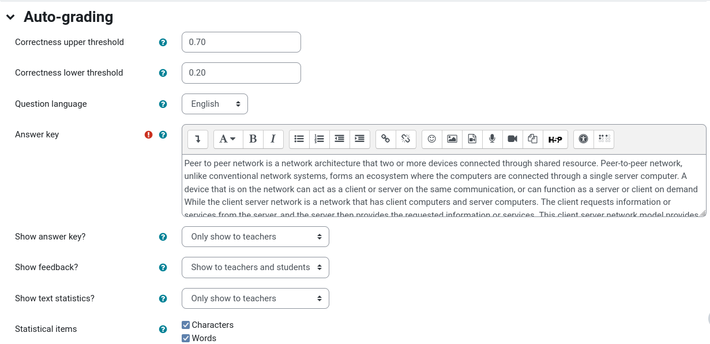
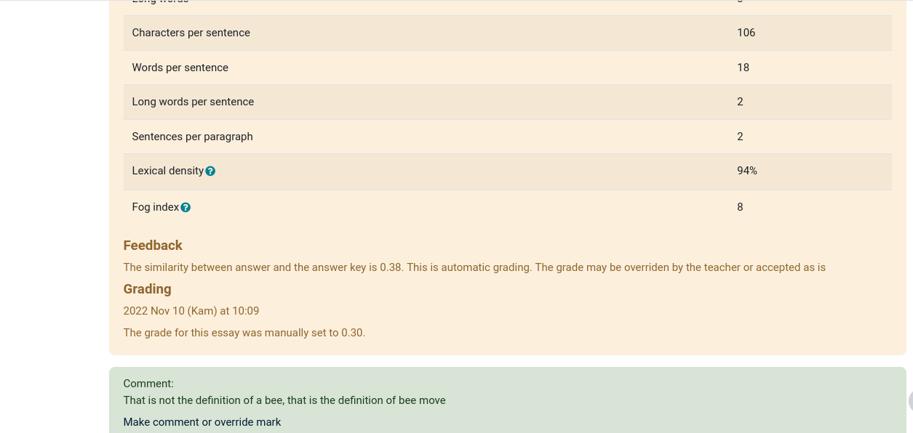

# Essay Similarity Checker
Is a moodle question type plugin that compares the similarity between student's answer and teacher's answer key using cosine similarity, and uses the similarity to auto grading the question. The automatic grade can be manually overridden by the teacher



## Features
- Auto grading using cosine similarity
- Statistical text
- Answer key
- Show/hide the answer key, statistical text, and feedback to student/teacher/both

## Installation
You can choose the following method that suits yout to install the plugin
### Using Terminal
Go to your moodle root directory and execute the following command
```
git clone https://github.com/thoriqadillah/essaysimilarity.git question/type/essaysimilarity
```
### Manual
Download the zip and extract it to the question/type inside your moodle root directory

After that go to site administration page and it should shows that new plugin is present

## Uninstall
Delete the essaysimilarity folder inside your moodle

## License
[GPL v3](https://github.com/thoriqadillah/essaysimilarity/blob/main/LICENSE)

Thanks to Gordon Bateson (@gbateson) that allows me to use his [plugin](https://github.com/gbateson/moodle-qtype_essayautograde) as reference to build my own